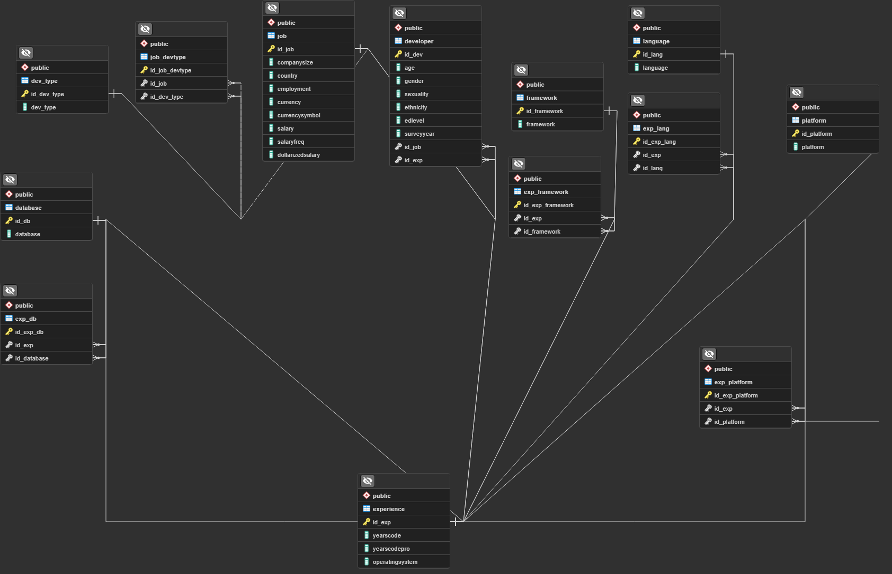
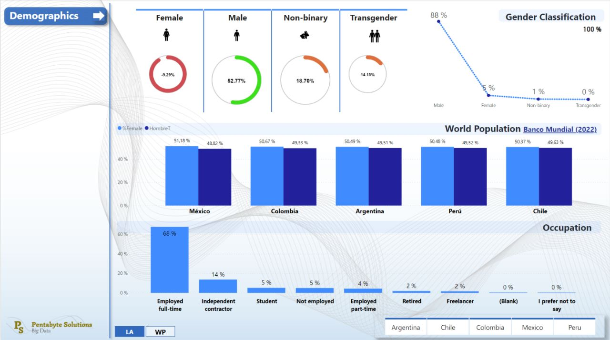
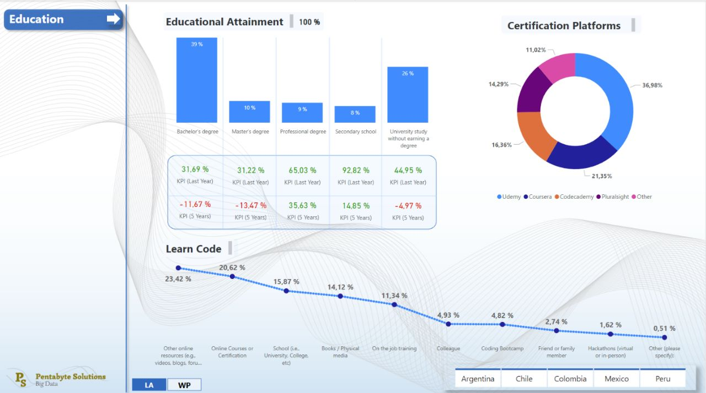

# PENTABYTE SOLUTIONS

## Quienes somos

Somos una consultora especializada en Big Data y tecnología de la información. Brindamos servicios a otras compañías que requieren extraer informacion importante de datos desestructurados o provenientes de fuentes de información diversas para maximizar sus negocios.

---

## Nuestra misión en este proyecto
Desarrollar herramientas tecnológicas que les permitan a nuestro cliente (empresas de reclutamiento del área de IT) alcanzar sus objetivos.

La empresa solicitante busca ser pionera en cuestiones de inclusión de género, específicamente en cuanto a la inclusión de mujeres y a la democratización de los puestos de IT tan demandados hoy en día. 

---

## Resumen del proyecto
En este proyecto se generaron un conjunto de herramientas para facilitar a las empresas reclutadoras lograr sus objetivos respecto a la inclusión de mujeres en puestos de IT.

Las herramientas mas relevantes desarrolladas son:
- Dahsboards interactivos para analizar información relacionada con puestos de trabajo, sueldos, porcentajes de mujeres en puestos IT, nivel educativo, etc. los 5 paises con mas puestos IT de la latinoamerica (Argentina, Chile, Mexico, Colombia y Perú)
- Dahsboards interactivos para analizar información relacionada con puestos de trabajo, sueldos, porcentajes de mujeres en puestos IT, nivel educativo, etc. en las 5 potencias tecnológicas mas grandes (Estados Unidos, India, Canadá, Reino Unido y Alemania)
- Modelos de predicción de ML para catalogar candidados y candidatas a los puestos mas solicitados.

### KPI's Utilizados

Se incluyen indicadores clave de desempeño (KPI’s) para medir:
- Grado académico de los perfiles que se presentan a la búsqueda laborar en el área de IT
- Información de genero:
    - “Female”
    - “Male”
    - “Non-Binary” 
    - “Transgender”
- Relación del cargo o trabajo en el área de IT en correlación con la retribución salarial. 

Estos KPI permitirán a la empresa de reclutamiento del área de IT en Latino América realizar ajustes y mejoras en el programa de inclusión de genero a medida que avanza el proceso.

---
#### Fuentes de Información utilizadas

> Las fuentes de información utilizadas para los dashboards son las encuestas de los útimos 5 años de Stackoverflow

## Stack tecnológico utilizado

### Análisis exploratorio de los datos
- Python
- Librerías:
    - Pandas
    - Numpy
    - Matplotlib
    - Seaborn

### Datawarehouse: **Supabase**

Supabase es una plataforma de código abierto que proporciona una solución completa para el desarrollo de aplicaciones web y móviles, incluyendo herramientas para el almacenamiento y gestión de datos. Una de las funcionalidades que ofrece Supabase es la capacidad de construir un data warehouse en la nube utilizando su servicio de bases de datos.

La creación de un data warehouse en Supabase implica la creación de una base de datos relacional y la utilización de herramientas de transformación de datos para cargar y organizar los datos en la base de datos. Supabase utiliza **PostgreSQL** como base de datos subyacente, lo que permite una alta disponibilidad y escalabilidad.

### Arquitectura del Datawarehouse: Snowflake

### Dashboards interactivos y KPI': PowerBI

---

### Automatización de carga de datos incremental
- Máquina virtual de Ubuntu corriendo en Windows (WSL)
- Apache Airflow (dockerizado)
- Librerías de python utilizadas
    - Pandas
    - Numpy
    - SQLAlchemy

Video demostrativo de carga incremental:

[Carga incremental de datos](https://www.youtube.com/watch?v=_XuUhEgKUV4)

### Informacion adicional
Link: [Notion-It-Job-Market-Trends](https://camiseta-blanca-poison.notion.site/IT-Job-Market-Trends-79fd9c2c1f714b76aa79b0837280768a)

    - Diccionario de columnas
    - Informacion de los datasets antes y despues de la limpieza
    - Boards de Trello embebidos

